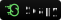

### Hi there 👋

<!--
**tde-nico/tde-nico** is a ✨ _special_ ✨ repository because its `README.md` (this file) appears on your GitHub profile.

Here are some ideas to get you started:

- 🔭 I’m currently working on ...
- 🌱 I’m currently learning ...
- 👯 I’m looking to collaborate on ...
- 🤔 I’m looking for help with ...
- 💬 Ask me about ...
- 📫 How to reach me: ...
- 😄 Pronouns: ...
- ⚡ Fun fact: ...

-->

	
	
	
	
	
	
	
	
	
	<!--  -->
	

## My Skill Set
<table><tr><td valign="top" width="33%">

### Languages

	
	<!--  -->
	
	
	
	<!--  -->
	<!--  --->
	<!--  --->
	<!--  --->
	<!--  --->
	<!--  --->
	
	
	<!--  --->
	<!--  -->
	
	<!--  --->
	<!--  -->
	
	

</td><td valign="top" width="33%">

### Frameworks and Libraries

	<!--  -->
	<!--  -->
	<!--  -->
	
	
	
	
	
	
	<!--  -->
	
	
	
	<!--  -->
	
	
	<!--  -->
	<!--  -->
	<!--  -->
	<!--  --->

	
</td><td valign="top" width="33%">

### Technologies

	<!--  -->
	<!--  -->
	
	<!--  -->
	
	
	
	<!--  -->
	
	<!--  -->
	<!--  -->
	<!--  -->
	<!--  -->
	<!--  -->
	<!--  -->
	
	<!--  -->
	<!--  -->
	<!--  -->
	<!--  -->
	
	
	<!--  -->
	<!--  -->

</td></tr></table>  

<table><tr><td valign="top" width="50%">

### Softwares

	
	
	
	
	
	
	

</td></tr></table>

## Github Stats

<tr>
<td>
	 
</td>
<td>
	
</td>
</tr>

## 42 Stats

<table><tr>
	
</tr></table>

